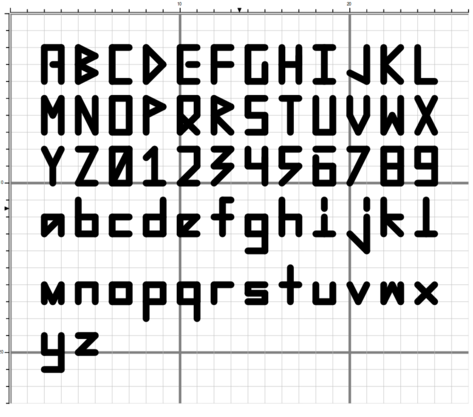
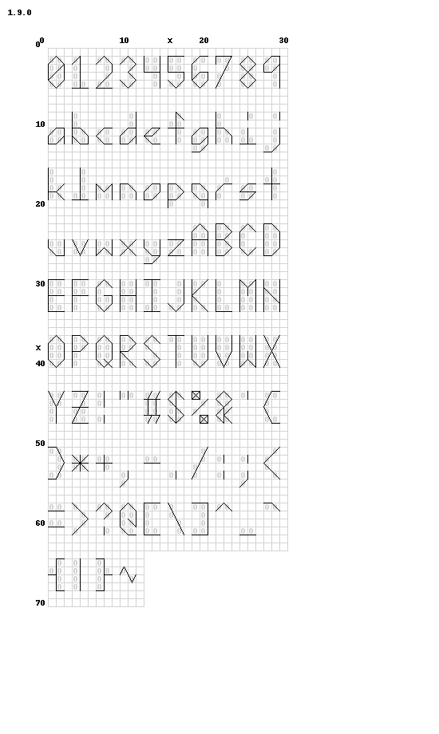
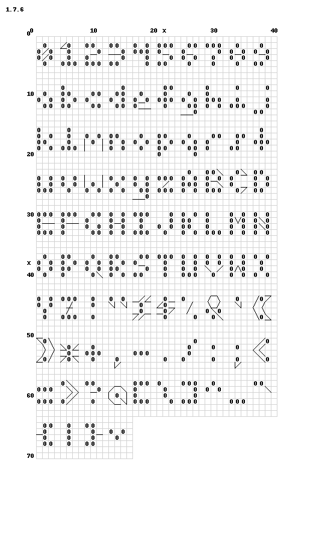
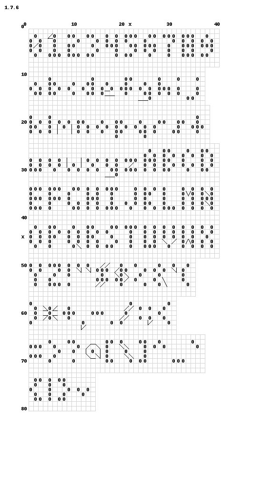
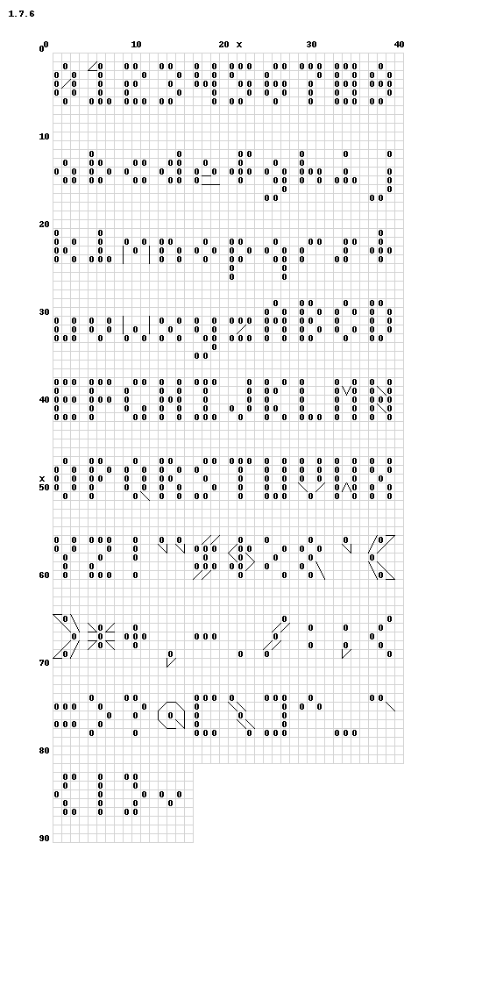
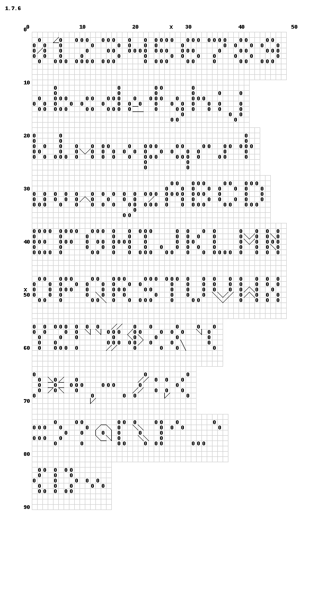
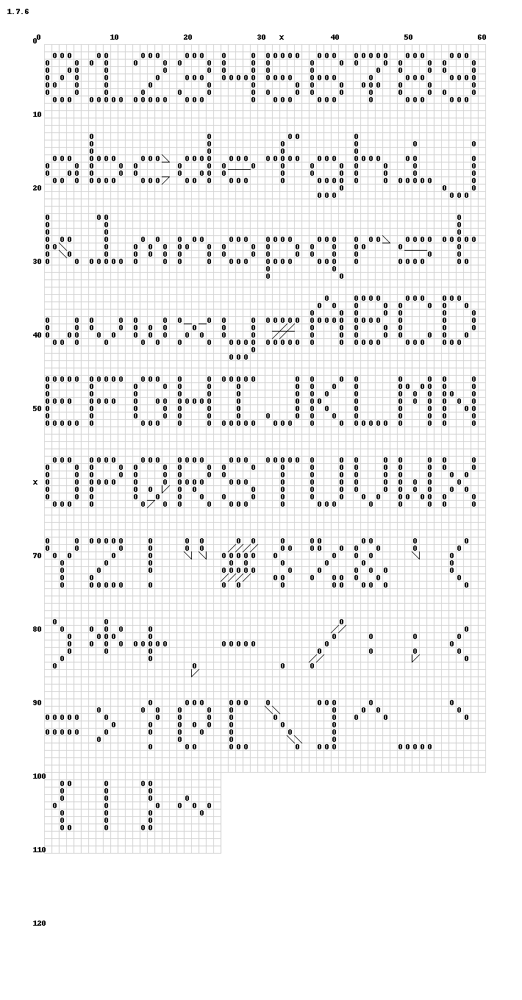
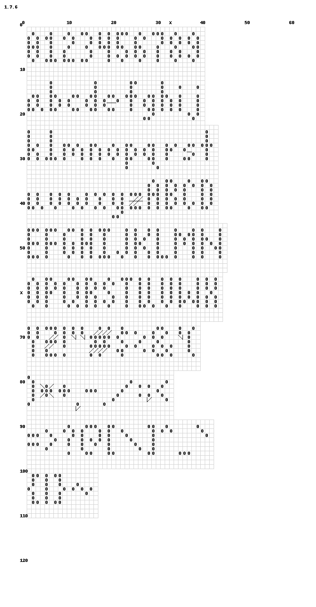

Fonts
===

Useful fonts for stitching the ASCII (printable) character set. Fonts
with a "p" suffix indicate they are proportional (do not align/not same size per character)

| | | |
| --- | --- | --- |
| 1x3 | 2x5 | 3x5 |
|  |  |  |
| 3x6p | 3x7 | 4x7p |
|  |  |  |
| 5x9 | 5x9p | |
|  |  | |
